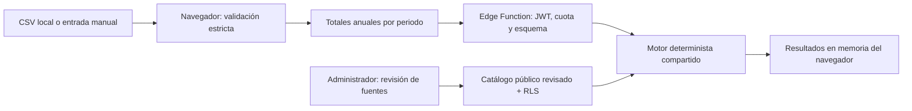

# Arquitectura y límites de privacidad

En demostración el motor y el catálogo ficticio se ejecutan exclusivamente en el navegador. En producción el servidor recalcula contra su propio catálogo; no acepta precios de alternativas enviados por el cliente. La UI valida los precios públicos devueltos y reconstruye los resultados con el mismo motor.

## Fronteras

1. **Archivo → navegador.** CSV máximo 2 MiB, sin columnas desconocidas, números sin texto libre ni fórmulas, errores sin eco de valores o nombres. No hay subida de archivo ni uso de Storage. La validación no puede demostrar que cualquier patrón numérico sea anónimo; reduce superficie y obliga a un formato mínimo.
2. **Navegador → función.** Objeto estricto: consumo anual P1/P2/P3, dos potencias y precios actuales. No fechas, horas, metadatos del archivo ni instrucciones libres para un LLM.
3. **Función → Postgres.** Lectura RLS de ofertas publicadas/vigentes; una escritura de contador operacional por sujeto Auth. Ningún consumo o resultado se persiste.
4. **Mercado → futuro RAG.** Solo fuentes públicas revisadas. Los extractos no se consideran instrucciones ejecutables. La futura ingesta debe escribir borradores y requerir validación antes de publicar precios. No existe aún un LLM en el camino del usuario.

## Datos que sí existen

| Dato | Ubicación | Retención |
| --- | --- | --- |
| Archivo y serie horaria | Memoria temporal de navegador durante validación | Referencias descartadas tras agregar; no se promete borrado seguro de RAM |
| Totales, precios y gráfica | Estado React | Hasta borrar, recargar o cerrar |
| Token anónimo | Memoria del cliente Supabase | Sin persistencia local; cierre local o fin de página |
| Registro Auth anónimo | Supabase Auth | Depende de limpieza administrativa configurada |
| Identificador + contador horario | Tabla privada | Limpieza diaria configurable; borrar >24 horas |
| IP y metadatos técnicos | Proveedores de hosting/Auth/CAPTCHA | Política del despliegue |
| Tarifas y documentos públicos | Postgres | Persistentes, con revisión y vigencia |

No se interpreta el acceso anónimo como `anon`: las sesiones anónimas de Auth usan el rol `authenticated`. No hay políticas de escritura para consumidores ni claves administrativas en la app. No hay correo, historial personal ni APIs de guardar resultados en esta fase.

## Riesgos y límites conocidos

- La demanda puede revelar hábitos; se minimiza a tres totales y no se envía a modelos de lenguaje.
- `Borrar datos` elimina referencias de la página, no los logs del proveedor ni la identidad Auth persistente. No es una operación de borrado criptográfico.
- Cambios futuros en calendarios, impuestos, precios o condiciones requieren revisión; la caducidad de revisión de 30 días no garantiza por sí sola que una oferta siga vigente comercialmente.
- El rate limit por sesión no resuelve ataques distribuidos o creación masiva de cuentas. Mantener CAPTCHA, límites de Auth y controles operativos.
- No se promete una cuantía de factura ni cumplimiento jurídico automático. El coste se estima con hipótesis visibles y un catálogo acotado.
